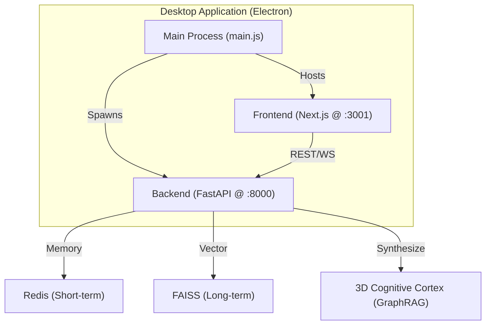

# 🎼 AI Orchestra Desktop (V4)

[]()
[]()
[]()
[](https://opensource.org/licenses/MIT)

**AI Orchestra Desktop** is a high-performance, multi-LLM orchestration environment. It transforms complex engineering tasks into a streamlined desktop experience where you can manage parallel AI sessions, visualize project intelligence in a **Living 3D Memory Cortex**, and trace the **Universal Causal Lineage** of every AI reasoning chain with absolute precision.

---

## ✨ Key Features

- 🖥️ **Native Desktop Experience** - High-performance wrapper powered by Electron.
- 🧠 **Living AI Memory Cortex** - A production-grade 3D visualization engine mapping your AI's collective intelligence.
- ⛓️ **Universal Causal Lineage** - Explicitly trace the path from **Session** ➔ **Task** ➔ **LLM** ➔ **Output**.
- 🔭 **Deep Zoom Navigation** - Microscopic interaction with nodes and macroscopic "God View" of the entire network.
- 🎯 **Fidelity Session Selector** - Granular control to isolate or combine specific cognitive threads in the graph.
- 🚀 **One-Command Setup** - Unified project lifecycle with a single `npm run dev` command.
- ⚡ **Seamless Model Switching** - Hot-swap between Local (Ollama) and Cloud (OpenAI/Anthropic/Gemini) models.
- 🐕 **Watchdog Automation** - Background agents that auto-resolve low-level LLM questions.
- 🎨 **Premium Aesthetics** - High-contrast solid shaders, neon pointers, and glassmorphic HUD interfaces.

---

## 🏗️ Architecture

The system operates as a unified triad, synchronized by the Electron Main Process:



---

## 🧠 Cognitive Graph Topology

The "Living AI Memory Cortex" is a high-fidelity tracing engine that visualizes the **Universal Causal Lineage** of your AI orchestration.

### 🎨 Semantic Color Code
- 🟠 **Task (Orange)**: The intent or objective (e.g., User Prompt).
- 🟡 **LLM (Gold)**: The intelligence hub (e.g., GPT-4, Claude 3).
- 🟢 **Output (Green)**: The result or synthesized knowledge.
- 🔵 **Session (Cyan)**: The conversational context container.
- 🔴 **Error (Red)**: Critical system or reasoning failures.

### ⛓️ Universal Causal Chain
The system enforces a rigid sequential relationship to ensure logical tracing:
**Session** ➔ **Task** ➔ **LLM Hub** ➔ **Final Output**

---

## 🛠️ System Requirements

Before installing, ensure you have the following installed:

- **Node.js**: v18.0 or higher (v20+ recommended)
- **Python**: 3.11 or higher
- **Redis**: Required for short-term memory (Can run locally via Docker or native install)
- **Git**: For version control

---

## 📦 Dependency Installation

The project is divided into three main parts. You need to install dependencies for each.

### 1. Root (Electron & Orchestration)
Used for the desktop wrapper and dev server management.
```bash
npm install
```
*Key Dependencies: `electron`, `concurrently`, `wait-on`*

### 2. Frontend (Next.js)
The React-based user interface.
```bash
cd frontend
npm install
cd ..
```
*Key Dependencies: `next`, `react`, `framer-motion`, `three`, `react-force-graph-3d`, `zustand`*

### 3. Backend (FastAPI)
The Python orchestration engine. It is recommended to use a virtual environment.
```bash
# Optional: Create and activate virtual environment
python -m venv venv
source venv/bin/activate  # On Windows use `venv\Scripts\activate`

# Install dependencies
pip install -r requirements.txt
```
*Key Dependencies:*
- **Web Framework:** `fastapi`, `uvicorn`, `pydantic`
- **AI/LLM:** `openai`, `anthropic`, `sentence-transformers`
- **Memory/Data:** `redis`, `faiss-cpu`, `numpy`, `scikit-learn`
- **Utilities:** `python-dotenv`, `httpx`

---

## ⚙️ Configuration

1. **Environment Variables**: Copy the example file and fill in your API keys.
   ```bash
   cp .env.example .env
   ```
2. **Key Variables**:
   - `OPENAI_API_KEY`: For GPT-4o/GPT-3.5
   - `ANTHROPIC_API_KEY`: For Claude 3.5 Sonnet/Opus
   - `GEMINI_API_KEY`: For Google Gemini models
   - `REDIS_URL`: Defaults to `redis://localhost:6379`

---

## 🚀 Running the Application

### Development Mode (Recommended)
Starts the backend, frontend, and Electron window simultaneously:
```bash
npm run dev
```

### Individual Components
- **Backend Only**: `npm run backend` (Runs at `http://localhost:8000`)
- **Frontend Only**: `cd frontend && npm run dev` (Runs at `http://localhost:3001`)
- **Electron Only**: `npm run electron`

### Quick Tests
- **API Smoke Test**: `python run_api.py` (Verifies backend connectivity)
- **CLI Chat Test**: `python cli/test_chat.py` (Tests orchestrator logic)

---

## 📁 Project Structure

- `app/` — FastAPI application (Routers, Orchestrator, LLM Adapters).
- `frontend/` — Next.js + React UI source code.
- `cli/` — CLI helpers and diagnostic tools.
- `main.js` — Electron main process entry point.
- `requirements.txt` — Python backend dependencies.
- `package.json` — Root-level scripts and Electron configuration.

---

## 📜 License

This project is licensed under the MIT License - see the [LICENSE](LICENSE) file for details.
