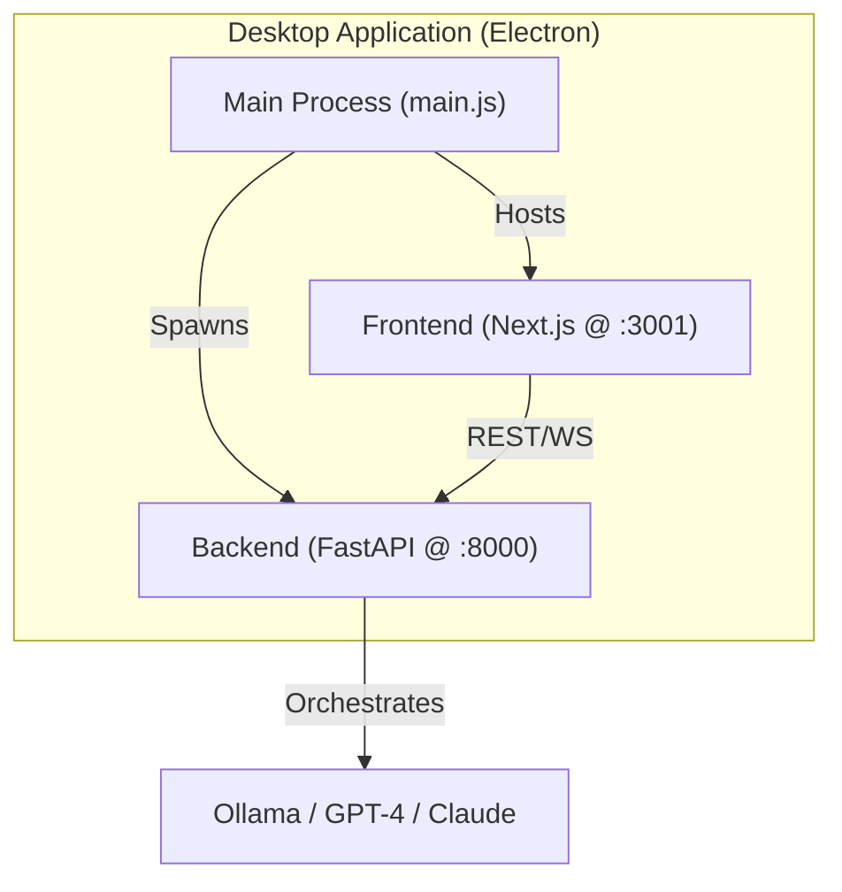

# 🎼 AI Orchestra Desktop (V4)

[]()
[]()
[]()

**AI Orchestra Desktop** is a native, multi-LLM orchestration environment designed for complex engineering tasks. It transforms the legacy CLI into a high-performance desktop application where you can manage parallel AI sessions, visualize global project intelligence, and switch between models (Ollama, GPT, Claude) with zero context loss.

---

## ✨ Key Features

- 🖥️ **Native Desktop Experience** - High-performance wrapper powered by Electron.
- 🚀 **One-Command Setup** - Unified project lifecycle with a single `npm run dev` command.
- 🔍 **Real-Time State Explorer** - Live dashboard visualizing session goals, decisions, and parallel task progress.
- 🧠 **Global Intelligence State** - A centralized "brain" shared across all parallel AI sessions.
- ⚡ **Seamless Model Switching** - Hot-swap between Local (Ollama) and Cloud (OpenAI/Anthropic) models.
- 🐕 **Watchdog Automation** - Intelligent background agents that auto-resolve low-level LLM questions.
- 🛠️ **Hardened API** - Production-grade FastAPI backend with robust error handling and WebSocket isolation.

---

## 🏗️ Architecture

The system operates as a unified triad, synchronized by the Electron Main Process:



---

## 🚦 Quick Start

### 1. Prerequisites
- **Node.js** (v18+)
- **Python** (3.11+)
- **Ollama** (Recommended for local inference)

### 2. Installation

Clone and install dependencies for all layers:

```bash
# Install root dependencies
npm install

# Install frontend dependencies
cd frontend && npm install && cd ..

# Install backend dependencies
pip install -r requirements.txt
```

### 3. Environment Setup
```bash
cp .env.example .env
# Add your OPENAI_API_KEY and ANTHROPIC_API_KEY
```

### 4. Launch the Orchestra
The desktop app handles everything for you:

```bash
npm run dev
```
*This starts the Next.js dev server, spawns the FastAPI backend, and launches the Electron window.*

---

## 📊 The State Explorer

The core of AI Orchestra is the **Global State**. It ensures that even if you have 10 parallel sessions, they all share a single source of truth:

- **Goals**: The overarching mission of the project.
- **Decisions**: A log of finalized architectural or logic choices.
- **Open Tasks**: Shared todo-list for all active agents.
- **Context Summary**: Compressed project memory.

---

## 🛠️ Advanced Usage (Legacy CLI)

For power users who prefer the terminal, the legacy CLI is still available:

```bash
| Command | Description |
| :--- | :--- |
| `/new "<task>"` | Create a new parallel AI session |
| `/sessions` | List all active sessions |
| `/switch <id> <model>` | Hot-swap a session's model |
| `/state` | Dump the global intelligence state |
| `/exit` | Terminate the CLI |

---

The system should feel like:
- → ONE AI brain
- → MANY parallel thinking processes
- → ZERO interruption
- → FULL control

## License

MIT